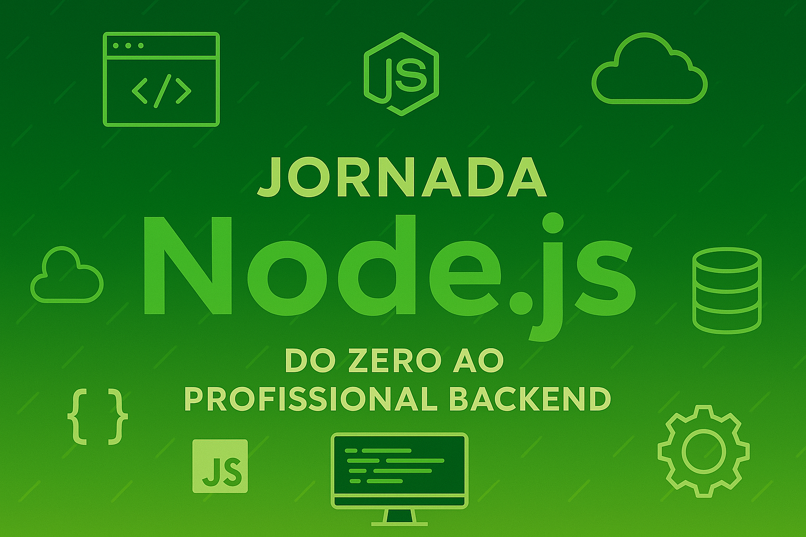

# 📘 Jornada Node.js – Do Zero ao Profissional Backend

---

**Título:** Jornada Node.js – Do Zero ao Profissional Backend
**Subtítulo:** Guia prático de 12 meses para dominar backend com Node.js
**Autor:** Anderson Ventura

---

## 📑 Sumário Interativo

| Nº | Seção                         | Subtópicos                                                     | Link Clicável                                           |
| --- | ------------------------------- | --------------------------------------------------------------- | -------------------------------------------------------- |
| 1   | 📘 Introdução                 | O que é backend, Por que aprender Node.js, Como usar esse guia | [Ir para Introdução]()                                 |
| 2   | 📚 Glossário Técnico          | JSON, REST, API, Middleware, JWT, ORM, etc.                     | [Ir para Glossário](#-glossário-técnico)              |
| 3   | 📅 Plano de Estudos – 12 Meses | 12 Módulos de conteúdo prático e teórico                    | [Ir para Plano de Estudos](#-plano-de-estudos--12-meses) |
| 4   | 📌 Temas e Tecnologias          | Tecnologias abordadas mês a mês                               | [Ir para Temas](#-temas-e-tecnologias)                   |
| 5   | 📊 Tabelas e Calendário        | Progresso semanal, organização visual                         | [Ir para Tabelas](#-tabelas-e-calendário-de-estudos)    |
| 6   | 🧰 Templates e Recursos         | README profissional, ESLint, Commits, Trello                    | [Ir para Templates](#-templates-e-recursos-úteis)       |
| 7   | ❤️ Apoie e Compartilhe        | GitHub Sponsors, Buy Me a Coffee, etc.                          | [Ir para Apoie](#️-apoie-e-compartilhe)                 |
| 8   | 📥 Baixe Agora                  | Link direto para baixar o PDF                                   | [Ir para Download](#-baixe-agora)                        |

---

## 📘 Introdução

**O que é Backend:**
Backend é a parte do desenvolvimento responsável por toda a lógica por trás de um sistema. Ele lida com banco de dados, autenticação, regras de negócio, APIs e muito mais.

**Por que aprender Node.js:**
Node.js é leve, rápido, possui uma comunidade enorme, e permite usar JavaScript no servidor, unificando a stack.

**Como usar esse guia:**
Siga o plano mês a mês, use o checklist, pratique com os projetos e anote seu progresso. É feito para ser seguido com 1h de estudo por dia, de segunda a sábado.

---

## 📚 Glossário Técnico

| Termo      | Definição                                                        |
| ---------- | ------------------------------------------------------------------ |
| JSON       | Formato leve de troca de dados entre aplicações                  |
| REST       | Estilo arquitetural para criação de APIs                         |
| API        | Interface de programação que permite integração entre sistemas |
| Middleware | Funções que interceptam e manipulam requisições/respostas      |
| JWT        | Token usado para autenticação segura                             |
| ORM        | Ferramenta que mapeia objetos para bancos de dados relacionais     |

## 📅 Plano de Estudos – 12 Meses (1hora) Segunda á Sabados:

Cada módulo representa 1 mês de estudo, com carga horária de 1h/dia (Seg-Sáb). Contém teoria, prática, links úteis, checklist e projeto final.

### Mês 1 – ⚛️ Fundamentos do JavaScript e Ambiente

- [ ]  💻 JavaScript moderno (ES6+)
- [ ]  🔡 Variáveis, ⚙️ funções, 🧱 classes
- [ ]  💻 Node.js instalado e configurado
- [ ]  💻 Uso do VSCode e 🧩 plugins úteis
- [ ]  🚀 Projeto: Script CLI com entrada de dados

### Mês 2 – 🌿 Git e 🐙 GitHub

- [ ]  💾 Versionamento com Git
- [ ]  🌳 Fluxo de branches
- [ ]  📝 Commits semânticos
- [ ]  📚 Projeto: Repositório organizado com README

### Mês 3 – ⚙️ Node.js e 📦 Módulos

- [ ]  🧩 Módulos internos e externos
- [ ]  📦 npm e 📂 estrutura de projeto
- [ ]  💰 Projeto: Conversor de moedas CLI

### Mês 4 – 🌐 Express e 🔗 APIs REST

- [ ]  🏗️ Criar servidor com Express
- [ ]  🗺️ Rotas, 🚦 Middlewares e 🚥 Status HTTP
- [ ]  📝 Projeto: API de tarefas (CRUD)

### Mês 5 – 📊 Banco de Dados SQL (PostgreSQL)

- [ ]  💻 SQL básico (SELECT, INSERT, JOIN)
- [ ]  ✨ Uso do Prisma ORM
- [ ]  🏦 Projeto: API com banco relacional

### Mês 6 – 🧱 Banco de Dados NoSQL (MongoDB)

- [ ]  💡 Conceitos NoSQL
- [ ]  🍃 MongoDB com Mongoose
- [ ]  📰 Projeto: Blog com MongoDB

### Mês 7 – 🔑 Autenticação e 🛡️ Segurança

- [ ]  🔑 JWT e <0xF0><0x9F><0xAA><0x99> bcrypt
- [ ]  🔒 Proteção de rotas e ✅ validações
- [ ]  👤 Projeto: API autenticada de usuários

### Mês 8 – ✅ Testes com Jest

- [ ]  🧪 Testes unitários e de integração
- [ ]  📡 Supertest para APIs
- [ ]  🤖 Projeto: API com testes automatizados

### Mês 9 – ⚙️ DevOps e 🐳 Docker

- [ ]  📦 Conceitos de containerização
- [ ]  🐳 Dockerfiles e 🚢 docker-compose
- [ ]  🚀 Projeto: API dockerizada

### Mês 10 – 📑 Documentação e 📊 Monitoramento

- [ ]  📜 Swagger para APIs;
- [ ]  🪵 Winston e logs;
- [ ]  📈 Projeto: API documentada e com logs;

### Mês 11 – 🌠 GraphQL e 🔗 WebSocket

- [ ]  ❓ Consultas GraphQL;
- [ ]  ⚡ WebSocket com Socket.io;
- [ ]  💬 Projeto: Chat em tempo real;

### Mês 12 – 💼 Portfólio, 🗣️ Entrevistas e 🏆 Projetos Finais

- [ ]  💻 README, 🖼️ Portfólio, 💡 Dicas de Entrevistas;
- [ ]  🥇 Projeto: API final completa + 🚀 deploy;
- [ ]  JavaScript moderno (ES6+);
- [ ]  Variáveis, funções, classes;
- [ ]  Node.js instalado e configurado;
- [ ]  Uso do VSCode e plugins úteis;
- [ ]  Projeto: Script CLI com entrada de dado;

## 📌 Temas e Tecnologias

1. JavaScript moderno (ES6+)
2. Git e GitHub (Commits, branches)
3. VSCode (plugins e boas práticas)
4. Node.js (módulos core, npm)
5. APIs REST com Express
6. Banco de dados: PostgreSQL e MongoDB
7. ORM: Prisma e Mongoose
8. Autenticação com JWT e bcrypt
9. Testes com Jest e Supertest
10. Docker, Redis e uploads
11. Documentação com Swagger
12. GraphQL e WebSocket
13. Estrutura MVC e Clean Code
14. Segurança (OWASP Top 10)
15. Gestão com Trello ou Jira
16. Relatórios técnicos

---

## 📊 Tabelas e Calendário de Estudos

| Semana | Dias de Estudo | Atividade                               |
| ------ | -------------- | --------------------------------------- |
| 1      | Seg a Sáb     | Leitura + Vídeo introdutório          |
| 2      | Seg a Sáb     | Prática com exercícios                |
| 3      | Seg a Sáb     | Projeto guiado                          |
| 4      | Seg a Sáb     | Finalização + Checklist + Anotações |

---

## 🧰 Templates e Recursos Úteis

- README.md profissional
- Modelo de commits semânticos
- ESLint configurado
- Trello com checklist mensal

---

## ❤️ Apoie e Compartilhe

**Se este guia te ajudou:**

- ⭐ Dê uma estrela no GitHub
- ☕ [Buy me a coffee](https://www.buymeacoffee.com)
- 💬 Compartilhe com a comunidade
